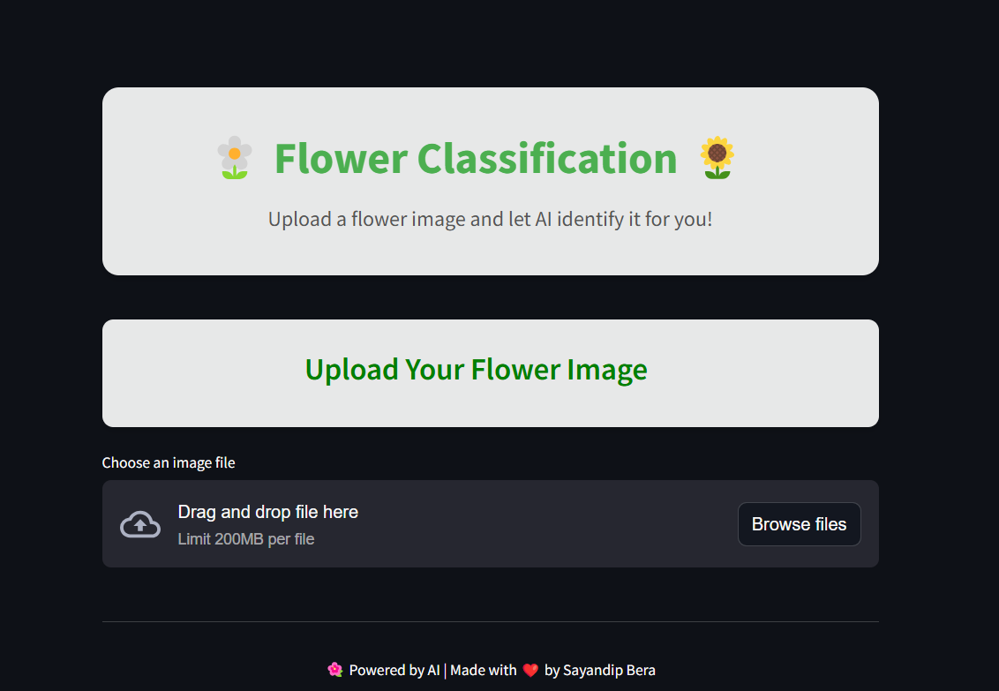
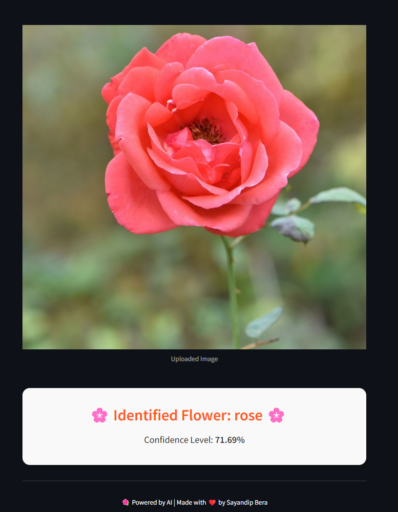

# 🌼 Flower Classification Model 🌻

Welcome to the **Flower Classification Model** repository! This project uses a Convolutional Neural Network (CNN) to classify images of flowers into five categories: **Daisy, Dandelion, Rose, Sunflower, and Tulip**. The application is deployed with **Streamlit**, offering an intuitive and stylish interface for real-time image classification.

---

## 🚀 Features

- **Deep Learning Model**: A robust CNN architecture built with TensorFlow and Keras.
- **Data Augmentation**: Improved model generalization using techniques like random flipping, rotation, and zoom.
- **Streamlit Web App**: A sleek and responsive UI for uploading and classifying flower images.
- **Modern Styling**: CSS animations and a beautiful layout for a user-friendly experience.
- **Real-Time Predictions**: Upload an image and get predictions with confidence scores.

---

## 📁 Dataset Overview

The dataset includes images of five flower categories:
- Daisy
- Dandelion
- Rose
- Sunflower
- Tulip

Each category contains hundreds of images, ensuring a diverse dataset for training.

---

## 🛠️ Technologies Used

- **Programming Languages**: Python
- **Libraries**: TensorFlow, Keras, NumPy, Matplotlib, PIL
- **Web Framework**: Streamlit
- **Tools**: ImageDataGenerator, Sequential API

---

## 🏗️ Model Architecture

- **Data Augmentation**: Random flipping, rotation, and zoom
- **Normalization**: Rescaling input images
- **Convolutional Layers**: 3 layers with `ReLU` activation
- **Pooling Layers**: Max pooling for dimensionality reduction
- **Dropout Layer**: To prevent overfitting
- **Dense Layers**: Fully connected layers for classification
- **Output Layer**: 5 neurons for the flower categories

---

## 🔮 Results

The model achieves impressive accuracy, with real-time predictions showcased in a **Streamlit-based web application**.

---

## 🖼️ Demo

### Upload an image:


### Prediction result:


---

## 💻 How to Use

1. **Clone this repository**:
   ```bash
   git clone https://github.com/YourUsername/flower-classification
2. **Install dependencies**:
   ```bash 
   pip install -r requirements.txt
3. **Run the Streamlit app:**:
   ```bash 
    streamlit run app.py 
4. **Upload a flower image and let the model classify it for you!**

## 🛠️ Installation Requirements

- **Python 3.8+**
- **TensorFlow**
- **Keras**
- **Streamlit**
- **NumPy**
- **Matplotlib**
- **PIL**

---
## 🌟 Star this repository if you found it helpful! Happy coding! 💻
